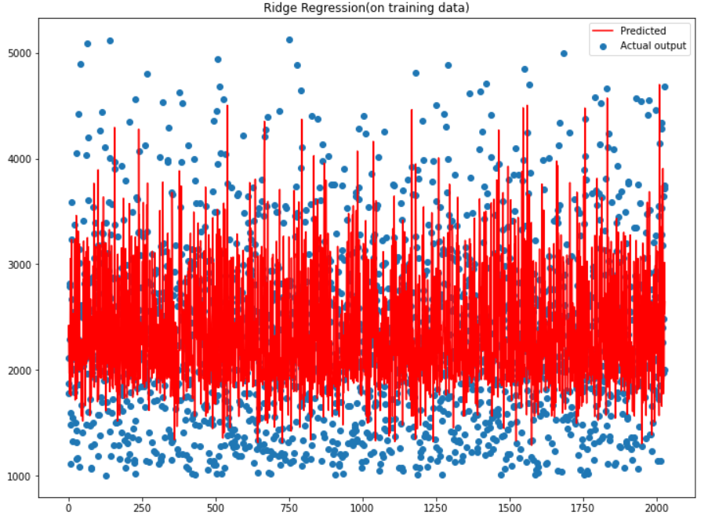
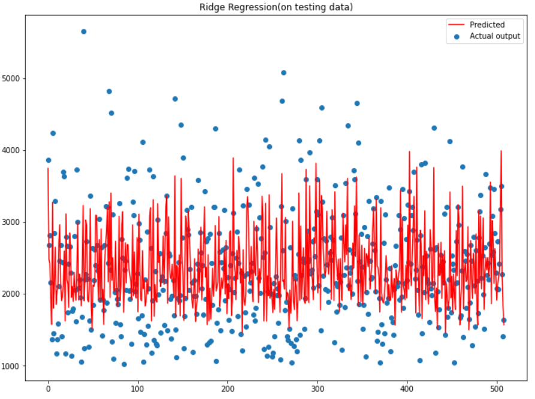

# CSE523-Machine-Learning-Data-Pirates
Agricultural Yield Prediction using regression

# 1) Introduction
Agriculture is one of the most important sector of the Indian Economy.With the Increasing Human population and Urbanization, understanding the need of agricultural yield is also increasing day by day.Better accuracy while predicting the yield is desirable because an accurate prediction helps the farmers to decide on what to grow, when to grow and how much to grow.The crop yield  mainly depends on the following factors :
1. Rainfall
2. Type of Soil
3. Type of fertilizers used
4. Crop Production

# 2)Results : 
Implemented the Ridge Regression from scratch and plotted the error for the testing data as well as for the training data.

# 3) References : 
1. [https://www.youtube.com/watch?v=Nol1hVtLOSg]
2. [https://www.youtube.com/watch?v=nxFG5xdpDto]
3. Dataset: [http://data.icrisat.org/dld/src/crops.html]
4. [http://apps.iasri.res.in/agridata/20data/HOME_20.HTML]
5. [https://tn.data.gov.in/catalog/statistical-hand-book-2019-agriculture#web_catalog_tabs_block_10]
6. [https://scikit-learn.org/stable/modules/linear/_model.html]
7. [https://scikit-learn.org/stable/modules/gen]

# 4) Contact Us : 
If you have any query regarding the project please contact us through our Email id's yugamsinh.c@ahduni.edu.in, kashish.s2@ahduni.edu.in, harsh.p1@ahduni.edu.in and hriday.n@ahduni.edu.in
